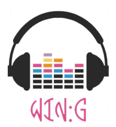

## 						Win:G 인디 음악 홍보 플랫폼

2019년 12월 ~ 2020년 6월까지 진행한 멀티캠퍼스 마이크로서비스 전문가 양성과정에서 진행한 최종 프로젝트입니다.

최종 평가 결과 10개 팀 가운데 1위를 하였습니다.

#### 프로젝트 기획 배경 및 목표

마이크로서비스 전문가 양성과정을 통해 배운 Infra, Front-end, Back-end, CI/CD 내용을 충실히 반영하며, 마이크로서비스 아키텍처에 적합한 Win:G 프로젝트를 기획하였습니다. Win:G란 뮤지션들에게 날개를 달아준다는 뜻의 Wing과 목표를 이루는 이룬다는 뜻의 Win + Goal을 합쳐서 만들었습니다.

저희는 인디 뮤지션들이 편향된 음악 시장에서 음악 활동을 하면서 어려움을 느낀다는 것과 사용자들이 본인들이 좋아하는 뮤지션들을 접하기 힘들다는 문제점을 해결하기 위해 Win:G 플랫폼을 기획했습니다. 

#### 애자일 방법론

프로젝트의 생명주기 동안 반복적인 개발을 촉진하는 애자일 방법론을 채택해서 이슈에 대해 유연하게 대처하고 요구사항을 충분히 반영할 수 있도록 하였습니다.

**스프린트**를 나눠서 계획적으로 개발을 할 수 있게 하였고 **데일리 스크럼**을 통해 어제 있었던 이슈, 오늘 해야 할 일, 의문점을 서로 교환하여 진행 상황에 대한 인지와 맡은 일에 대한 책임감을 상기시켰습니다. 

지속적인 테스트와 오류 수정으로 동작하는 프로그램을 목표로 하고 이후에 완성도를 높여갔습니다.

 

##### 협업에 사용된 도구

메시지 채널은 `Slack` 을 이용하였습니다. 문제나 궁금증에 관해 묻거나 기술 적용에 있어서 참고하면 좋은 팁 등을 공유하는 용도로 사용하였습니다. 

또한, `Confluence`, `Jira`, `GitHub`를 연동하여 프로젝트 진행에 관한 모든 상황을 실시간으로 반응할 수 있게 하였습니다.

 

**Confluence**를 통해 개발과정에서 나오는 이슈 해결법, 기술 공유, 회의록 등을 문서화하여, 정리하고 기록하는 팀 문화가 정착되도록 했습니다.

 

**Jira**를 사용하여 이슈트래킹을 했습니다. 

프로젝트의 특성 중 하나인 점진적 구체화로 인해 초기의 계획대로 완성되는 프로젝트는 거의 없으므로 프로젝트 중 변하는 상황에 대응하기 위해 Jira를 사용한 것이 많은 도움이 되었습니다.

 일정을 4개의 스프린트로 나누어 관리하였고 각 단계별로 해야할 작업을 구분하여 완성했습니다

형상 관리 도구로는 **GitHub**를 사용하였습니다. 

프로젝트 중 업무를 나눠 작업하고 합칠 때 GitHub를 통해 pull request, 코드 확인, 승인의 흐름을 따라 충돌을 최소화하였습니다.

​										

 

프로젝트 진행에 대해서 멘토님께 조언을 받거나 진행 상황을 체크할 때 Zoom을 이용해 화상회의로 진행했습니다.

#### 아키텍처

##### MSA 아키텍처

Win:G 서비스를 MSA 구조로 설계했습니다. 3개의 GCP VM 인스턴스에 1개의 Manager Node, 2개의 Worker Node를 구성하였고, 도커 스웜을 활용하여 컨테이너 오케스트레이션을 구성했습니다. 

각 서비스는 독립적인 Database를 가지고 있으며 User Service의 DB를 제외한 나머지 서비스의 DB는 도커 컨테이너에 구성했습니다.

각 서비스는 RESTful한 방식으로 통신하기 때문에 API 명세에 맞는 형식의 JSON 타입의 데이터를 전달해주기만 하면 원하는 결과를 얻을 수 있습니다. 

이외에도 개별적인 Scale-Out이 필요한 경우, 하나의 서비스 때문에 전체를 Scale-Out 하는 모놀리식과는 달리 MSA에서는 부하가 걸리는 특정 서비스만 Scale-Out 하면서 유동적이고 효율적으로 운영할 수 있습니다.

##### 프로젝트 구조도

저희 팀은 기존 모놀리식과 MSA의 차이를 경험해 보기 위해,

**최초 모놀리식 형식으로 개발을 완료한 후 MSA 기반으로 마이그레이션하는 형식으로 프로젝트를 수행했습니다.** 

모놀리식에서는 프론트엔드, 백엔드 각각 하나의 프로젝트로 구성되었던 것이 MSA에서는 5개의 백엔드 서비스로 나눠진 것을 확인할 수 있습니다.

##### CI/CD Pipeline

**Jenkins**와 **Docker Swarm**을 사용하여 CI(빌드 자동화)와 CD(배포 자동화)를 구축했습니다.

GitHub에 push를 하면 Jenkins에서 test와 build 과정이 실행됩니다. 

실행 결과를 Jenkins Dashboard에서 확인하는 것이 번거롭기 때문에 slack으로부터 notification을 받을 수 있도록 플러그인을 설치했습니다.

CI 프로세스를 통과한 코드는 각 서비스가 가지고 있는 Docker Hub의 image로 생성이 되고, 실행 중인 Docker Service가 있다면 서비스에 수정사항이 release 될 수 있도록 구성했습니다.

##### Docker Swram - Visualizer

Visualizer를 이용해서 스웜 클러스터에 컨테이너 그룹이 배치된 모습을 시각화하였습니다.

서비스 장애 발생 시에도 지속해서 서비스가 가능하도록 replicas 옵션을 통해 각 서비스마다 설정한 개수만큼 정상 동작하는 컨테이너들을 유지하도록 하였습니다.

#### RESTful API - Swagger

Swagger를 이용해 개발과 동시에 인터페이스에 필요한 엔드포인트, 요청 및 응답 문서의 형식을 쉽게 확인, 참조할 수 있도록 했습니다

#### 기대효과

#### 향후 개선사항

COVID-19로 인해 프로젝트 기간이 2개월에서 1개월로 단축되어 전체 개발 범위를 2단계로 나눴습니다. 

1단계에 적용할 기술 및 서비스들은 구현을 완료하였으며, 향후 2단계에서 적용할 내용을 기술적, 서비스 관점에서 정리해 보았습니다. 

